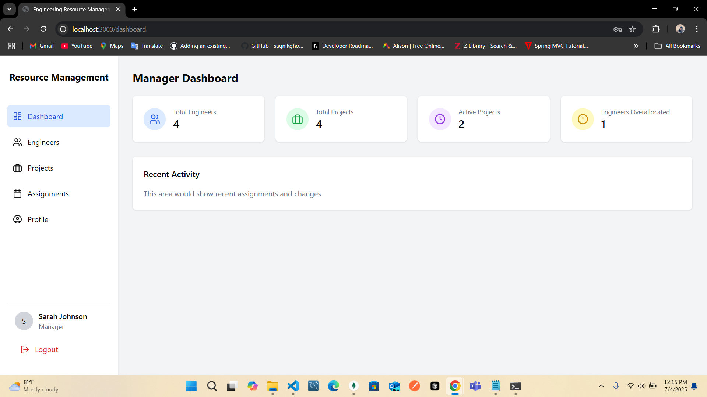
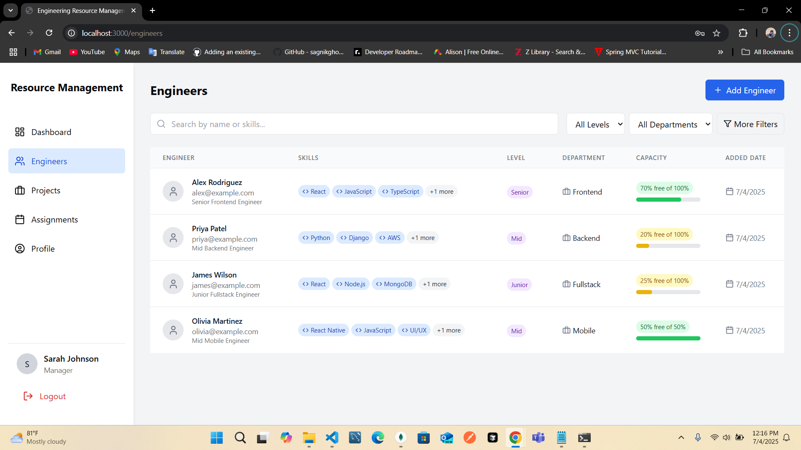
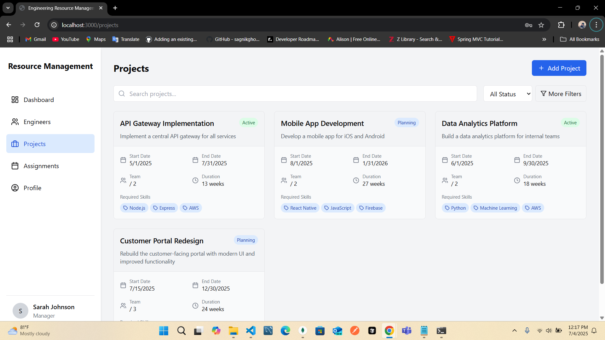

# Engineering Resource Management System

A full-stack application to manage engineering team assignments across projects. Track who's working on what, their capacity allocation, and when they'll be available for new projects.

## Features

- **Authentication & User Roles**: Login system with Manager and Engineer roles
- **Engineer Management**: Track skills, seniority, employment type, and availability
- **Project Management**: Create and manage projects with required skills and timelines
- **Assignment System**: Assign engineers to projects with capacity tracking
- **Dashboard Views**: Different views for managers and engineers
- **Search & Analytics**: Find resources and view utilization metrics
- **Capacity Planning**: Prevent over-allocation with automatic capacity checks

## Tech Stack

### Frontend
- React with TypeScript
- ShadCN UI components with Tailwind CSS
- React Hook Form for forms
- Zustand for state management
- Charts for analytics

### Backend
- Node.js with Express
- MongoDB for database
- JWT for authentication
- RESTful API design

## Setup Instructions

### Prerequisites
- Node.js (v18+)
- MongoDB
- npm or yarn

### Quick Setup (macOS/Linux)
```bash
# Install all dependencies and start both servers
npm run install-all && npm run dev
```

### Manual Setup

#### Backend Setup
```bash
cd server
npm install

# Create environment variables
echo "MONGODB_URI=mongodb://localhost:27017/eng-res-mgmt
JWT_SECRET=supersecretkey
JWT_EXPIRE=7d" > .env

# Seed the database
node seedData.js

# Start the server
node server.js
```

#### Frontend Setup
```bash
cd client
npm install
npm run dev
```

### Windows Setup
For Windows users, a setup script is provided:
```
setup_windows.bat
```

This script will check for required dependencies, install packages, set up environment variables, seed the database, and start both servers.

### Default User Accounts

After running the seed script, the following user accounts are available:

#### Manager
- Email: manager@example.com
- Password: password123

#### Engineers
- Email: engineer1@example.com
- Password: password123

### Accessing the Application
- Frontend: http://localhost:5173
- Backend API: http://localhost:5001

## AI Development Approach

This project was developed with the assistance of AI tools:

- **GitHub Copilot**: Used for code generation and autocompletion
- **AI-assisted code review**: Used for optimizing code quality
- **AI for architectural decisions**: Used for designing the system architecture

### Examples of AI Acceleration
(To be documented during development)

### Challenges with AI-Generated Code
(To be documented during development)

### Validation Approach
(To be documented during development)

## Project Structure

- `/client` - Frontend React application
- `/server` - Backend Node.js API
- `/server/models` - Database schemas
- `/server/routes` - API endpoints
- `/client/src/components` - Reusable UI components
- `/client/src/pages` - Application pages

## Sample Data

The application includes seed data with:
- 3-4 Engineers with different skills and capacity
- 3-4 Projects with various requirements
- 6-8 Assignments showing different scenarios
- Mix of full-time and part-time engineers

## Documentation

For detailed API documentation, including all endpoints, data models, and functionalities, see [API_DOCUMENTATION.md](./API_DOCUMENTATION.md).

## Repository

This project is hosted on GitHub at [https://github.com/rutuukulkarni/eng-resource-mgmt](https://github.com/rutuukulkarni/eng-resource-mgmt).

## Assignment System

The Assignment System is a core feature that enables managers to effectively allocate engineers to projects and track capacity utilization.

### Key Features

- **Assign Engineers to Projects**: Select engineer, project, allocation percentage, and duration
- **View Current Assignments**: See who's working on which project and for how long
- **Capacity Tracking**: Visual indicators show each engineer's current workload

### Implementation Details

1. **Engineer Selection**:
   - Filter engineers by skills
   - See real-time capacity information
   - Match engineers to projects based on required skills

2. **Project Assignment**:
   - Assign engineers directly from project details view
   - Set allocation percentage (5-100%)
   - Define assignment role and duration

3. **Capacity Visualization**:
   - Color-coded progress bars (blue: low, green: moderate, yellow: high)
   - Prevent over-allocation with automatic capacity checks
   - Track capacity at both engineer and project levels

4. **Assignment Management**:
   - View assignments from both project and engineer perspectives
   - Remove engineers from projects when needed
   - View timeline and duration information

### Screenshots

Here are some key views from the Assignment System:

- **Assignments Page**: List view of all assignments with capacity indicators
- **Add Assignment Modal**: Interface for creating new assignments with real-time capacity checks
- **Project Details**: Manage team assignments directly from project view
- **Engineers List**: View all engineers with their current capacity utilization

#### Login Screen


#### Registration Screen


#### Dashboard


#### Project Management


#### Engineer Assignments


#### Resource Allocation


#### Capacity Management
